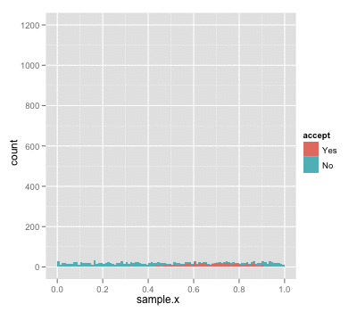

```{r, echo=FALSE, message=FALSE, warning=FALSE, include=FALSE}
library(ggplot2)
library(DBI)
library(data.table)
library(reshape2)
con <- dbConnect(RSQLite::SQLite(), "data/final.db")

res <- dbSendQuery(con, "SELECT COUNT(articleID) FROM article")
article_count <- as.integer(dbFetch(res))

res <- dbSendQuery(con, "SELECT COUNT(articleID) FROM poolarticle GROUP BY poolID")
pool_size <- dbFetch(res)
```

```{r max_feats_chart, echo=FALSE, message=FALSE, warning=FALSE, cache=TRUE, include=FALSE}
# Bin Value of Max Feature
# Return the max feature for each user. Histogram bin the occurances
res <- dbSendQuery(con, 'SELECT MAX(feat2, feat3, feat4, feat5, feat6) FROM user GROUP BY userID')
max_feats <- dbFetch(res, n=-1)
names(max_feats) <- c('max_feat')

max_feat_chart <- ggplot(max_feats, aes(max_feat)) + 
  geom_histogram(aes(y=(..count..)/sum(..count..)), binwidth=.1) + 
  xlim(c(0, 1)) +
  xlab("feature value") +
  ylab("density") + 
  ggtitle("Maximum User Membership Feature")
```

```{r top_arms, echo=FALSE, message=FALSE, warning=FALSE, cache=TRUE, include=FALSE}
top_arms_by_cluster <- data.frame()
for (i in 2:6) {
  res <- dbSendQuery(con, paste("SELECT AVG(click) as ctr, articleID, cluster from event LEFT JOIN article ON event.displayed=article.articleID LEFT JOIN user ON event.userID=user.userID WHERE cluster=", i, "GROUP BY articleID ORDER BY ctr DESC LIMIT 5"))
  top_arms_by_cluster <- rbind(top_arms_by_cluster, dbFetch(res, n=-1))
}
top_arms_by_cluster$articleID <- as.factor(top_arms_by_cluster$articleID)
top_arms_cluster_chart <- ggplot(top_arms_by_cluster, aes(x=articleID, y=ctr, fill=articleID)) + 
  geom_bar(stat='Identity') + 
  scale_fill_discrete(name='articleID') +
  ylab('CTR') +
  xlab('articleID') +
  ggtitle('Top 5 Articles Per User Cluster') +
  facet_wrap(~cluster, ncol=1)
```

```{r ctr_agnostic, echo=FALSE, message=FALSE, warning=FALSE, cache=TRUE, include=FALSE}
res <- dbSendQuery(con, 'SELECT AVG(click) as ctr, displayed as articleID from event GROUP BY displayed')
ctrs <- as.data.table(dbFetch(res, n=-1))
ctrs_top <- ctrs[articleID %in% top_arms_by_cluster$articleID]
ctrs_top$articleID <- as.factor(ctrs_top$articleID)
setkey(ctrs_top, articleID)
ctrs_top_chart <- ggplot(unique(ctrs_top), aes(x=articleID, y=ctr, fill=articleID)) +
    geom_bar(stat="identity") +
    ggtitle("CTRs (Cluster Agonistic) for Top 5 Articles Per Cluster") +
    xlab("articleID") +
    ylab("CTR")
```

```{r contextless, echo=FALSE, message=FALSE, warning=FALSE, cache=TRUE, include=FALSE}
# results
result <- read.table('data/crash.gz', header=TRUE)
result <- as.data.table(result)
result[, cumulativeReward:=cumsum(reward), by=list(policy)]
result_epsilon <- read.table('data/results_epsilon.gz', header=TRUE)
result_epsilon <- as.data.table(result_epsilon) 
result_epsilon[, cumulativeReward:=cumsum(reward), by=list(policy)] 

# strip out bad epsilon, leave out Indexed, put in good ones (and get rid of redundant)
result <- result[policy != 'EpsilonGreedy(0.1)' & policy != 'EpsilonGreedy(0.2)' & policy != 'IndexedUCB']
result <- rbind(result, result_epsilon[policy == 'EpsilonGreedy(0.1)'])

contextless_ctrs <- result[, max(cumulativeReward)/1000000, by=list(policy)]
setnames(contextless_ctrs, c('policy', 'V1'), c('Policy', 'CTR'))
contextless_ctrs <- contextless_ctrs[order(-CTR)]
contextless_results <- ggplot(result, aes(x=T, y=cumulativeReward, colour=policy)) + geom_line() + ggtitle('Cumulative Clicks Over Time')
```

```{r contextless_table_dat, echo=FALSE, message=FALSE, warning=FALSE, cache=TRUE, include=FALSE}
# Percent of arms pulled correctly
## clickthrough rates, cluster agnostic
res <- dbSendQuery(con, 'SELECT AVG(click) as ctr, displayed as articleID from event GROUP BY displayed')
ctrs <- dbFetch(res, n=-1)
ctrs <- as.data.table(ctrs) 
ctrs[, articleRank:=rank(-ctr, ties.method='first')]
ctrs <- ctrs[order(articleRank)]
ctrs[, UCB:=sum(result$policy=='UCB' & result$arm_pulled==articleID), by=articleID]
ctrs[, KLUCB:=sum(result$policy=='KL-UCB' & result$arm_pulled==articleID), by=articleID]
ctrs[, Thompson:=sum(result$policy=='Thompson' & result$arm_pulled==articleID), by=articleID]
ctrs[, Epsilon:=sum(result$policy=='EpsilonGreedy(0.1)' & result_epsilon$arm_pulled==articleID), by=articleID]
```

```{r contextless_tables, echo=FALSE, message=FALSE, warning=FALSE, cache=TRUE, include=FALSE}
ctrs_policies <- melt(ctrs, id.vars=c('ctr', 'articleID', 'articleRank'), variable.name='policy')
chosen_top100_chart <- ggplot(ctrs_policies[articleRank < 100,], aes(articleRank, value)) + geom_bar(stat='identity') + facet_wrap(~policy) + ylab('times pulled') + ggtitle("Times Article Chosen vs. Article Rank (Top 100)") 
chosen_all_chart <- ggplot(ctrs_policies, aes(articleRank, value)) + geom_bar(stat='identity') + facet_wrap(~policy) + ylab('times pulled') + ggtitle("Times Article Chosen vs. Article Rank")
```

```{r contextful, echo=FALSE, message=FALSE, warning=FALSE, cache=TRUE, include=FALSE}
# Contextful
result_context <- read.table('data/results_contextual.gz', header=TRUE)
result_context <- as.data.table(result_context)
result_context[, cumulativeReward:=cumsum(reward), by=list(policy)] 

contextful_ctrs <- result_context[, max(cumulativeReward)/1000000, by=list(policy)]
setnames(contextful_ctrs, c('policy', 'V1'), c('Policy', 'CTR'))
contextful_ctrs <- contextful_ctrs[order(-CTR)]

contextful_results <- ggplot(result_context, aes(x=T, y=cumulativeReward, colour=policy)) + geom_line() + ggtitle('Cumulative Clicks Over Time')
```

```{r linucbdat, echo=FALSE, message=FALSE, warning=FALSE, cache=TRUE, include=FALSE}
lindat <- read.table('data/linucb_test.gz', header=TRUE)
lindat <- as.data.table(lindat)
lindat[, cumulativeReward:=cumsum(reward), by=policy]
linchart <- ggplot(lindat, aes(x=T, y=cumulativeReward, colour=policy)) + 
  geom_line() + 
  ggtitle('LinUCB vs. Other Algorithms')
```

```{r allCTRsdat, echo=FALSE, message=FALSE, warning=FALSE, cache=TRUE, include=FALSE}
all_ctrs <- rbind(contextful_ctrs, contextless_ctrs)
all_ctrs <- all_ctrs[order(-CTR)]
```

## Introduction

- Testing empirical performance of a variety of bandit algorithms, both contextless and contextful
- Using the Yahoo! Webscope Today Module data [@yahoo], which covers 10 days of article recommendation data on the Yahoo! homepage
- Building heavily on Li, Chu et al 2011, which uses this dataset to create an unbiased estimator for bandit algorithm performance [@offlineEval]
    + Main contribution in further investigating characteristics of the specific dataset, and running far more algorithms on it
    + May also clean up implementations of algorithms and post publicly (hard to find actual code)

## Motivation

- Bandit algorithms are not as well empirically tested / benchmarked as most other areas of statistical learning--most current empirical tests are simulations or toy problems [@Auer2002; @GLMBandit]
    + Simulations are subject to bias, and obviously work well when underlying distribution matches that used by algorithm
    + Toy problems don't capture complexity of real-world problems
- Hard to find good benchmarks, since we can't see dataset counterfactuals (off-policy problem). We almost require online problems [@precup; @offlineEval]
- Yahoo! Today claims to be the first solid benchmark

## Yahoo! Today Module

```{r fig_yahoo, results='asis', fig.align='center', echo=FALSE}
cat("\n")
```

## Data Description / Characteristics
- 45,811,883 distinct visit events over 10 days in 2009
- `r article_count` articles observed within the course of the 10 days
- User is shown an article in the feature box
- Pool of articles is non-constant and can change (varies from `r min(pool_size)` to `r max(pool_size)`)
- Users and articles have 5 features based on conjoint analysis (and one constant feature)
- **Reward for our bandit algorithms, and primary evaluation metric, will be article clicks and/or clickthrough rate**

## Problem Formulation

For algorithm/policy $P$, each trial $t$ to $T$ trials:

1. Algorithm observes user $u_t$ and a set of $A_t$ arms (articles) 
together with context vector $x_{t,a}$ for $a \in A_t$. $x_{t,a}$ contains 
features and interactions from both user $u_t$ and arm $a_t$. Specifically 
$x_{t,a} = \mathbf{u} \mathbf{a}^T$ where $\mathbf{u}$ is the feature 
vector for user $u_t$ and $\mathbf{a}$ is the feature vector for arm $a_t$
2. Based on $A$'s observations of rewards per arm for previous trial trials, 
$P$ chooses arm from $A_t$ and recieves payoff $r_{t,a}$.
3. Algorithm updates strategy based on new observation. No feedback is 
received for unchosen arms.

## Unbiased Estimator {.smaller}

`Policy Evaluator` (from Li et al., 2011)

0. Inputs $T > 0$; bandit algorithm $P$; stream of events $S$\
1. $h_0 \leftarrow \emptyset\text{   {empty history}}$\
2. $\hat{G_P} \leftarrow 0\text{   {zero payoff to start}}$\
3. $\mathbf{for}\text{ }t = 1,2,3,...,T \mathbf{do}$\
4. $\;\;\;\;\mathbf{repeat}$\
5. $\;\;\;\;\;\;\;\;\text{Get next event }(\mathbf{x}, a, r_a)\text{ from }S$\
6. $\;\;\;\;\mathbf{until}\text{ }P(h_{t-1}, \mathbf{x}) = a$\
7. $\;\;\;\;h_t \leftarrow$ `CONCATENATE`$(h_{t-1}, (\mathbf{x}, a, r_a))$\
8. $\;\;\;\;\hat{G_P} \leftarrow \hat{G_P} + r_a$\
9. $\mathbf{end\text{ }for}$\
10. Output: $\hat{G_P}/T$

## Rejection Sampling

- Policy estimator follows the same general principle
- Keep observations that fall within the distribution, else reject

```{r fig_reject, results='asis', fig.align='center', echo=FALSE}
cat("\n")
```

## Limitations

- Evaluator is biased for cases where stream $S$ of data is not finite (premature end)
- Lots of rejected data in order to get a desired $T$. On average:
    + 220,000 data points to get 10,000 useable observations
    + 6.7 million data points to get 300,000 useable observations
    + 25 million data points to get 1 million useable observations
- In this case, limiting $T$ to 1 million at most, which means $S$ is effectively infinite
- Given $K$ arms, we'd expect $\frac{K-1}{K}$ discards [Li et al 2011]

# Exploring the Dataset

## Datapoints Close to Cluster Centers

- Features sum to one -- and in general, one feature dominates each user
- If clusters are closely linked to different articles, contextual bandits should do better than context-less

```{r fig_maxfeat, fig.align='center', echo=FALSE, cache=TRUE, fig.cap='Maximum features for each user vector.', fig.height=3}
max_feat_chart
```

## Clickthrough Rates for Clusters

```{r fig_toparms, fig.align='center', echo=FALSE, cache=TRUE, fig.cap='Top arms per cluster and their CTRs', fig.height=5}
top_arms_cluster_chart + theme(axis.text.x = element_text(angle = 90, vjust = 0.5, hjust=1))
```

## General CTR for Same Articles

```{r fig_armctrs, fig.align='center', echo=FALSE, fig.cap='Same top arms, general CTR ignoring user clusters / side information', fig.height=5}
ctrs_top_chart + theme(axis.text.x = element_text(angle = 90, vjust = 0.5, hjust=1))
```

# Results

## Algorithms Compared {.smaller}

### **Context-Less**
- **Random**
- **UCB** (Lai & Robbins 1985 & Cappé et al 2013) [@LaiRobbins; @cappe2013]
- **KL-UCB** (Cappé et al 2013) [@cappe2013]
- **Thompson Sampling** (Thompson 1933) [@thompson1933]

### **Indexed**
- **Indexed UCB**

### Contextual
- **Thompson Sampling** (Agrawal & Goyal 2014) [@conthompson]
- **LinUCB** (Li, Chu et al 2010) [@conBanditNews]
- **GLM-UCB** (Filippi 2010) [in progress...] [@GLMBandit]

## Results (Context-Less) {.smaller}

- KL-UCB and Thompson Sampling do the best, matching literature [@empthompson; @cappe2013]

```{r xcresults, echo=FALSE, warning=FALSE, cache=TRUE}
contextless_results
```

## Results (Contextual) {.smaller}

- Indexed UCB and contextual Thompson Sampling do worse than expected [@conthompson]

```{r conresult, echo=FALSE, warning=FALSE, cache=TRUE}
contextful_results
```

## Results (Contextual Continued) {.smaller}

- LinUCB, as we'd expect, performs better with its access to side information

```{r linresult_chart, echo=FALSE, warning=FALSE, cache=TRUE}
linchart
```

## Comparison of Clickthrough Rates

- LinUCB and GLM-UCB would likely be even better than these results (not shown here, since these are all $T = 1,000,000$)

```{r, echo=FALSE, warning=FALSE}  
all_ctrs
```

## Examining Article Selection

```{r xcpullall, echo=FALSE, warning=FALSE, cache=TRUE}
chosen_all_chart
```

## Further Work and Investigation

- Further evaluation on contextful algorithms against what they should have pulled for each user cluster
- Trying to get LinUCB and GLM-UCB running in some sort of reasonable time
- Why does contextual Thompson Sampling do so terribly (along with indexed UCB)?

## Conclusions

- Empirical results are mostly what we expect and largely match past, simulation results [@empthompson; @GLMBandit; @Auer2002]
- "Rejection sampling" is a good technique for evaluating various bandit algorithms
- Limited in some ways to web applications, due to high rejection rate, but will hopefully cause more interest in collecting this type of data

## References {.smaller}

